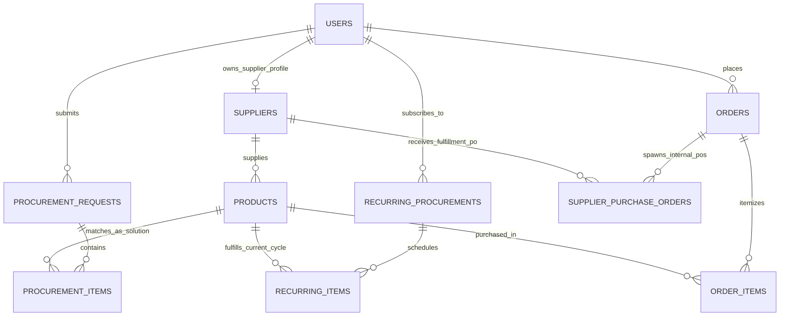

# EasyBuy: Database Architecture & Relationship Blueprint
## File: `databaseplan.md`

This document defines the complete database architecture, table schemas, data types, indexes, and Eloquent relationships required for the **EasyBuy AI Procurement Platform**.

---

## 1. Complete Entity Relationship Diagram (ERD)



---

## 2. Table Specifications & Column Dictionaries

### 2.1. Core Authentication & RBAC

#### Table: `users`
Stores all account credentials and roles (Buyers, Suppliers, Admins).

| Column | Type | Constraints | Description |
| :--- | :--- | :--- | :--- |
| `id` | `BIGINT UNSIGNED` | `PRIMARY KEY`, `AUTO_INCREMENT` | Unique User ID |
| `username` | `VARCHAR(255)` | `UNIQUE`, `NOT NULL` | Display username |
| `email` | `VARCHAR(255)` | `UNIQUE`, `NOT NULL`, `INDEX` | Account login email |
| `password` | `VARCHAR(255)` | `NOT NULL` | Bcrypt hashed password |
| `role` | `ENUM` | `DEFAULT 'buyer'`, `NOT NULL` | `'buyer'`, `'supplier'`, `'admin'` |
| `company_name` | `VARCHAR(255)` | `NULLABLE` | Business name for B2B buyers |
| `phone` | `VARCHAR(50)` | `NULLABLE` | Contact phone number |
| `remember_token` | `VARCHAR(100)` | `NULLABLE` | Laravel Remember Me token |
| `created_at` / `updated_at` | `TIMESTAMP` | `NULLABLE` | Timestamps |

---

### 2.2. Supplier Network & KYB Verification Layer (Invisible to Buyer)

#### Table: `suppliers`
Stores vetted backend fulfillment partners with KYB (Dojah / Manual vetting) tracking.

| Column | Type | Constraints | Description |
| :--- | :--- | :--- | :--- |
| `id` | `BIGINT UNSIGNED` | `PRIMARY KEY`, `AUTO_INCREMENT` | Supplier ID |
| `user_id` | `BIGINT UNSIGNED` | `FOREIGN KEY` -> `users.id`, `ON DELETE CASCADE` | Owner user account |
| `company_name` | `VARCHAR(255)` | `NOT NULL` | Legal entity/vendor name |
| `business_type` | `VARCHAR(100)` | `DEFAULT 'Wholesaler'` | Manufacturer, Wholesaler, Importer |
| `business_reg_number` | `VARCHAR(100)` | `NULLABLE`, `INDEX` | Tax ID / RC Number / EIN |
| `contact_email` | `VARCHAR(255)` | `NOT NULL` | Dispatch notification email |
| `contact_phone` | `VARCHAR(50)` | `NOT NULL` | Dispatch manager direct phone |
| `warehouse_address` | `TEXT` | `NOT NULL` | Courier pickup address |
| `city` | `VARCHAR(100)` | `NOT NULL` | Warehouse city |
| `postal_code` | `VARCHAR(30)` | `NULLABLE` | Warehouse postal code |
| `category` | `VARCHAR(100)` | `NOT NULL`, `INDEX` | Primary industry (Office, IT, Janitorial) |
| `lead_time_days` | `INT UNSIGNED` | `DEFAULT 2` | Average dispatch turnaround days |
| `rating` | `DECIMAL(3,2)` | `DEFAULT 5.00` | Internal quality score (1.00 - 5.00) |
| `bank_name` | `VARCHAR(100)` | `NULLABLE` | Payout Bank Name |
| `account_number` | `VARCHAR(50)` | `NULLABLE` | Payout Bank Account Number |
| `routing_code` | `VARCHAR(50)` | `NULLABLE` | Swift / Routing code / Sort Code |
| `kyb_provider` | `VARCHAR(50)` | `DEFAULT 'dojah'` | Automated verification provider |
| `kyb_status` | `ENUM` | `DEFAULT 'pending'` | `'pending'`, `'verified'`, `'failed'` |
| `verification_status` | `ENUM` | `DEFAULT 'pending'`, `INDEX` | `'pending'`, `'approved'`, `'rejected'`, `'suspended'` |
| `verification_notes` | `TEXT` | `NULLABLE` | Admin manual check notes |
| `white_label_agreement` | `BOOLEAN` | `DEFAULT FALSE` | Agrees to blind packaging & EasyBuy slips |
| `approved_at` | `TIMESTAMP` | `NULLABLE` | Date approved by EasyBuy |
| `created_at` / `updated_at` | `TIMESTAMP` | `NULLABLE` | Timestamps |

---

### 2.3. Catalog & Inventory

#### Table: `products`
Master catalog items supplied by internal vendors and displayed on EasyBuy.

| Column | Type | Constraints | Description |
| :--- | :--- | :--- | :--- |
| `id` | `BIGINT UNSIGNED` | `PRIMARY KEY`, `AUTO_INCREMENT` | Product ID |
| `supplier_id` | `BIGINT UNSIGNED` | `FOREIGN KEY` -> `suppliers.id`, `ON DELETE CASCADE` | Internal vendor link |
| `name` | `VARCHAR(255)` | `NOT NULL`, `INDEX` | Product name (e.g. Ergonomic Chair) |
| `sku` | `VARCHAR(100)` | `UNIQUE`, `NOT NULL` | Internal Stock Keeping Unit |
| `category` | `VARCHAR(100)` | `NOT NULL`, `INDEX` | Category name |
| `description` | `TEXT` | `NULLABLE` | Product details and dimensions |
| `specifications` | `JSON` | `NULLABLE` | JSON key-values (color, wattage, material) |
| `cost_price` | `DECIMAL(10,2)` | `NOT NULL` | Wholesale cost paid to supplier |
| `price` | `DECIMAL(10,2)` | `NOT NULL`, `INDEX` | Customer retail price on EasyBuy |
| `stock_quantity` | `INT` | `DEFAULT 0` | Current available inventory |
| `image_url` | `VARCHAR(500)` | `NULLABLE` | Product image URL |
| `is_active` | `BOOLEAN` | `DEFAULT TRUE` | Visibility flag |
| `created_at` / `updated_at` | `TIMESTAMP` | `NULLABLE` | Timestamps |

---

### 2.4. AI Procurement Engine (One-Time Requests)

#### Table: `procurement_requests`
Stores raw user prompts and the generated quotes.

| Column | Type | Constraints | Description |
| :--- | :--- | :--- | :--- |
| `id` | `BIGINT UNSIGNED` | `PRIMARY KEY`, `AUTO_INCREMENT` | Request ID |
| `user_id` | `BIGINT UNSIGNED` | `FOREIGN KEY` -> `users.id`, `ON DELETE CASCADE` | Buyer account |
| `raw_prompt` | `TEXT` | `NOT NULL` | Original user input/list |
| `ai_parsed_summary` | `JSON` | `NULLABLE` | Structured JSON extracted by AI |
| `status` | `ENUM` | `DEFAULT 'draft'` | `'draft'`, `'analyzing'`, `'quoted'`, `'ordered'`, `'cancelled'` |
| `target_budget` | `DECIMAL(10,2)` | `NULLABLE` | User's spending cap if mentioned |
| `total_amount` | `DECIMAL(10,2)` | `DEFAULT 0.00` | Quoted total price |
| `total_savings` | `DECIMAL(10,2)` | `DEFAULT 0.00` | Calculated wholesale bundle discount |
| `created_at` / `updated_at` | `TIMESTAMP` | `NULLABLE` | Timestamps |

#### Table: `procurement_items`
Individual line items parsed from the prompt and matched to catalog products.

| Column | Type | Constraints | Description |
| :--- | :--- | :--- | :--- |
| `id` | `BIGINT UNSIGNED` | `PRIMARY KEY`, `AUTO_INCREMENT` | Item ID |
| `procurement_request_id` | `BIGINT UNSIGNED` | `FOREIGN KEY` -> `procurement_requests.id`, `ON DELETE CASCADE` | Parent request |
| `matched_product_id` | `BIGINT UNSIGNED` | `FOREIGN KEY` -> `products.id`, `NULLABLE`, `ON DELETE SET NULL` | Sourced supplier product |
| `requested_item_name` | `VARCHAR(255)` | `NOT NULL` | Name extracted from user prompt |
| `requested_quantity` | `INT UNSIGNED` | `DEFAULT 1` | Required quantity |
| `unit_price` | `DECIMAL(10,2)` | `NOT NULL` | Quoted unit price |
| `subtotal` | `DECIMAL(10,2)` | `NOT NULL` | `unit_price * requested_quantity` |
| `match_confidence` | `ENUM` | `DEFAULT 'high'` | `'exact'`, `'high'`, `'alternative'` |
| `created_at` / `updated_at` | `TIMESTAMP` | `NULLABLE` | Timestamps |

---

### 2.5. Autonomous Replenishment & Price-Watcher

#### Table: `recurring_procurements`
Stores recurring orders and dynamic price-watching configurations.

| Column | Type | Constraints | Description |
| :--- | :--- | :--- | :--- |
| `id` | `BIGINT UNSIGNED` | `PRIMARY KEY`, `AUTO_INCREMENT` | Subscription ID |
| `user_id` | `BIGINT UNSIGNED` | `FOREIGN KEY` -> `users.id`, `ON DELETE CASCADE` | Buyer account |
| `title` | `VARCHAR(255)` | `NOT NULL` | e.g. "Monthly Janitorial Restock" |
| `frequency` | `ENUM` | `DEFAULT 'monthly'` | `'weekly'`, `'bi-weekly'`, `'monthly'`, `'quarterly'` |
| `fulfillment_mode` | `ENUM` | `DEFAULT '1_tap_approval'` | `'1_tap_approval'`, `'autopilot'` |
| `next_run_date` | `DATE` | `NOT NULL`, `INDEX` | Next execution/review date |
| `auto_optimize_prices` | `BOOLEAN` | `DEFAULT TRUE` | Allow AI price watcher to swap cheaper SKUs |
| `status` | `ENUM` | `DEFAULT 'active'` | `'active'`, `'paused'`, `'cancelled'` |
| `last_total_price` | `DECIMAL(10,2)` | `DEFAULT 0.00` | Price of last executed cycle |
| `created_at` / `updated_at` | `TIMESTAMP` | `NULLABLE` | Timestamps |

#### Table: `recurring_items`
The target items in the recurring replenishment basket.

| Column | Type | Constraints | Description |
| :--- | :--- | :--- | :--- |
| `id` | `BIGINT UNSIGNED` | `PRIMARY KEY`, `AUTO_INCREMENT` | Item ID |
| `recurring_procurement_id` | `BIGINT UNSIGNED` | `FOREIGN KEY` -> `recurring_procurements.id`, `ON DELETE CASCADE` | Parent subscription |
| `current_product_id` | `BIGINT UNSIGNED` | `FOREIGN KEY` -> `products.id`, `ON DELETE RESTRICT` | Currently assigned catalog product |
| `item_name` | `VARCHAR(255)` | `NOT NULL` | Item description |
| `quantity` | `INT UNSIGNED` | `DEFAULT 1` | Desired units per cycle |
| `locked_price` | `DECIMAL(10,2)` | `NOT NULL` | Current agreed cycle price |
| `created_at` / `updated_at` | `TIMESTAMP` | `NULLABLE` | Timestamps |

---

### 2.6. Consolidated Orders & Internal Supplier Fulfillment

#### Table: `orders`
Single-invoice consolidated orders seen by the buyer.

| Column | Type | Constraints | Description |
| :--- | :--- | :--- | :--- |
| `id` | `BIGINT UNSIGNED` | `PRIMARY KEY`, `AUTO_INCREMENT` | Order ID |
| `user_id` | `BIGINT UNSIGNED` | `FOREIGN KEY` -> `users.id`, `ON DELETE RESTRICT` | Buyer account |
| `order_number` | `VARCHAR(50)` | `UNIQUE`, `NOT NULL` | e.g. `EB-2026-9481` |
| `total_amount` | `DECIMAL(10,2)` | `NOT NULL` | Total paid by customer |
| `payment_status` | `ENUM` | `DEFAULT 'paid'` | `'pending'`, `'paid'`, `'refunded'` |
| `fulfillment_status` | `ENUM` | `DEFAULT 'processing'` | `'processing'`, `'dispatched'`, `'delivered'` |
| `shipping_address` | `TEXT` | `NOT NULL` | Delivery destination |
| `created_at` / `updated_at` | `TIMESTAMP` | `NULLABLE` | Timestamps |

#### Table: `order_items`
Individual line items inside an order.

| Column | Type | Constraints | Description |
| :--- | :--- | :--- | :--- |
| `id` | `BIGINT UNSIGNED` | `PRIMARY KEY`, `AUTO_INCREMENT` | Line Item ID |
| `order_id` | `BIGINT UNSIGNED` | `FOREIGN KEY` -> `orders.id`, `ON DELETE CASCADE` | Parent order |
| `product_id` | `BIGINT UNSIGNED` | `FOREIGN KEY` -> `products.id`, `ON DELETE RESTRICT` | Product purchased |
| `quantity` | `INT UNSIGNED` | `NOT NULL` | Quantity |
| `unit_price` | `DECIMAL(10,2)` | `NOT NULL` | Price charged per unit |
| `subtotal` | `DECIMAL(10,2)` | `NOT NULL` | Subtotal |
| `created_at` / `updated_at` | `TIMESTAMP` | `NULLABLE` | Timestamps |

#### Table: `supplier_purchase_orders`
Internal Purchase Orders generated and routed to individual suppliers. **Invisible to the buyer**.

| Column | Type | Constraints | Description |
| :--- | :--- | :--- | :--- |
| `id` | `BIGINT UNSIGNED` | `PRIMARY KEY`, `AUTO_INCREMENT` | Internal PO ID |
| `order_id` | `BIGINT UNSIGNED` | `FOREIGN KEY` -> `orders.id`, `ON DELETE CASCADE` | Customer Order link |
| `supplier_id` | `BIGINT UNSIGNED` | `FOREIGN KEY` -> `suppliers.id`, `ON DELETE RESTRICT` | Assigned vendor |
| `po_number` | `VARCHAR(50)` | `UNIQUE`, `NOT NULL` | e.g. `PO-SUP-4819` |
| `total_cost` | `DECIMAL(10,2)` | `NOT NULL` | Wholesale cost to pay supplier |
| `status` | `ENUM` | `DEFAULT 'pending'` | `'pending'`, `'accepted'`, `'dispatched'` |
| `tracking_number` | `VARCHAR(100)` | `NULLABLE` | Carrier tracking number |
| `created_at` / `updated_at` | `TIMESTAMP` | `NULLABLE` | Timestamps |

---

## 3. Eloquent Model Relationships Code Mapping

```php
// ==================== User.php ====================
public function supplier(): HasOne {
    return $this->hasOne(Supplier::class);
}
public function procurementRequests(): HasMany {
    return $this->hasMany(ProcurementRequest::class);
}
public function recurringProcurements(): HasMany {
    return $this->hasMany(RecurringProcurement::class);
}
public function orders(): HasMany {
    return $this->hasMany(Order::class);
}

// ==================== Supplier.php ====================
public function user(): BelongsTo {
    return $this->belongsTo(User::class);
}
public function products(): HasMany {
    return $this->hasMany(Product::class);
}
public function purchaseOrders(): HasMany {
    return $this->hasMany(SupplierPurchaseOrder::class);
}

// ==================== Product.php ====================
public function supplier(): BelongsTo {
    return $this->belongsTo(Supplier::class);
}
public function procurementItems(): HasMany {
    return $this->hasMany(ProcurementItem::class, 'matched_product_id');
}
public function recurringItems(): HasMany {
    return $this->hasMany(RecurringItem::class, 'current_product_id');
}
public function orderItems(): HasMany {
    return $this->hasMany(OrderItem::class);
}

// ==================== ProcurementRequest.php ====================
public function user(): BelongsTo {
    return $this->belongsTo(User::class);
}
public function items(): HasMany {
    return $this->hasMany(ProcurementItem::class);
}

// ==================== ProcurementItem.php ====================
public function procurementRequest(): BelongsTo {
    return $this->belongsTo(ProcurementRequest::class);
}
public function product(): BelongsTo {
    return $this->belongsTo(Product::class, 'matched_product_id');
}

// ==================== RecurringProcurement.php ====================
public function user(): BelongsTo {
    return $this->belongsTo(User::class);
}
public function items(): HasMany {
    return $this->hasMany(RecurringItem::class);
}

// ==================== RecurringItem.php ====================
public function recurringProcurement(): BelongsTo {
    return $this->belongsTo(RecurringProcurement::class);
}
public function product(): BelongsTo {
    return $this->belongsTo(Product::class, 'current_product_id');
}

// ==================== Order.php ====================
public function user(): BelongsTo {
    return $this->belongsTo(User::class);
}
public function items(): HasMany {
    return $this->hasMany(OrderItem::class);
}
public function supplierPurchaseOrders(): HasMany {
    return $this->hasMany(SupplierPurchaseOrder::class);
}

// ==================== SupplierPurchaseOrder.php ====================
public function order(): BelongsTo {
    return $this->belongsTo(Order::class);
}
public function supplier(): BelongsTo {
    return $this->belongsTo(Supplier::class);
}
```

---

## 4. Migration Execution Sequence

To avoid foreign key dependency errors during migration, the migration files must run in this exact order:

1. `create_users_table` (already exists, add `role`, `company_name`, `phone`)
2. `create_password_reset_codes_table` (already exists)
3. `create_suppliers_table` (depends on `users`, includes KYB & warehouse fields)
4. `create_products_table` (depends on `suppliers`)
5. `create_procurement_requests_table` (depends on `users`)
6. `create_procurement_items_table` (depends on `procurement_requests` & `products`)
7. `create_recurring_procurements_table` (depends on `users`)
8. `create_recurring_items_table` (depends on `recurring_procurements` & `products`)
9. `create_orders_table` (depends on `users`)
10. `create_order_items_table` (depends on `orders` & `products`)
11. `create_supplier_purchase_orders_table` (depends on `orders` & `suppliers`)
