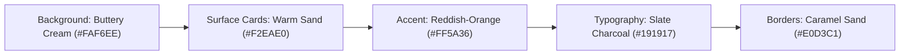

# EasyBuy: Warm Claymorphic Design System & Visual Guidelines
## File: `designsystem.md`

---

## 1. Aesthetic Vision: Warm Claymorphic Minimalism

EasyBuy blends **Tactile Claymorphism** with **Warm Earth Tones & Minimalist High-End Typography** to create an AI-powered procurement experience that feels tactile, human, and distinct.

### Core Visual Pillars:
1. **Warmth Over Sterile Tech**: Replacing cold corporate blues and artificial neon yellows with a grounded, premium palette — **buttery cream canvas, warm sand / light brown surface cards, deep slate charcoal, and energetic reddish-orange (`#FF5A36`) accents**.
2. **Tactile Sand Claymorphism**: Cards are sculpted from warm sand clay (`#F2EAE0`) with pillowy curves (`rounded-2xl` to `rounded-3xl`), dual-depth caramel shadows, and subtle top-edge highlights.
3. **High Contrast Typography**: Deep slate charcoal (`#191917`) text against warm sand surfaces ensures crystal-clear readability and WCAG AAA compliance.

---

## 2. Color Palette & Design Tokens

### 2.1. Palette Breakdown



| Token Name | Hex Code | Tailwind Equivalent / Usage | Visual Role |
| :--- | :--- | :--- | :--- |
| **`bg-canvas`** | `#FAF6EE` | `bg-[#FAF6EE]` | **Buttery Cream / Soft Linen** (Page canvas background) |
| **`bg-card`** | `#F2EAE0` | `bg-[#F2EAE0]` | **Warm Sand / Light Brown** (Main floating clay cards) |
| **`bg-card-subtle`** | `#E8DECF` | `bg-[#E8DECF]` | **Deeper Sand / Warm Almond** (Input fields, nested sections, tags) |
| **`brand-primary`** | `#FF5A36` | `bg-[#FF5A36]` | **Reddish-Orange / Terracotta** (Primary CTA, hero action, key indicators) |
| **`brand-primary-hover`** | `#E64522` | `hover:bg-[#E64522]` | **Deep Warm Ember** (Hover & active states) |
| **`brand-accent-amber`** | `#F5B838` | `text-[#F5B838]` / `bg-[#F5B838]` | **Golden Amber** (Rating stars, warning pills) |
| **`text-headline`** | `#191917` | `text-[#191917]` | **Deep Slate Charcoal** (Headlines & primary text) |
| **`text-body`** | `#5C5549` | `text-[#5C5549]` | **Warm Earth Umber** (Descriptions, specs & labels) |
| **`text-muted`** | `#9C9283` | `text-[#9C9283]` | **Muted Warm Stone** (Timestamps, placeholders) |
| **`border-soft`** | `#E0D3C1` | `border-[#E0D3C1]` | **Caramel Sand Outline** (Card & container borders) |
| **`border-subtle`** | `#EADFCF` | `border-[#EADFCF]` | **Soft Biscuit** (Internal dividers & grid lines) |

---

## 3. Typography Hierarchy

* **Headlines**: *Syne* / *Plus Jakarta Sans* (Extrabold / Bold with tight letter spacing `-0.03em`).
* **Body / UI**: *Space Grotesk* / *Inter* (Medium / Regular for effortless legibility).

| Level | Size / Weight | Line Height | Usage |
| :--- | :--- | :--- | :--- |
| **Hero Title** | `text-4xl sm:text-5xl lg:text-6xl` (`font-extrabold`) | `leading-[1.1]` | Main Hero Procurement Hook |
| **Section Title** | `text-2xl sm:text-3xl` (`font-bold`) | `leading-snug` | Dashboard & Catalog Section Headers |
| **Card Title** | `text-lg font-bold` | `leading-tight` | Product & Bundle Titles |
| **Body Regular** | `text-sm font-normal` | `leading-relaxed` | Descriptions & Specs |
| **Badge / Micro** | `text-xs font-semibold uppercase` | `tracking-wider` | Category Pills, EasyBuy Verified Tags |

---

## 4. Warm Sand Claymorphic Shadow Recipes

```css
/* 1. Large Hero & Feature Clay Card (Warm Sand) */
.clay-card-hero {
  background: #F2EAE0;
  border-radius: 32px;
  border: 1px solid #E0D3C1;
  box-shadow: 
    0 20px 40px -12px rgba(80, 55, 25, 0.09),
    0 4px 12px rgba(0, 0, 0, 0.02),
    inset 0 2px 4px rgba(255, 255, 255, 0.75),
    inset 0 -2px 4px rgba(180, 160, 130, 0.2);
}

/* 2. Interactive Product & Sourcing Card */
.clay-card {
  background: #F2EAE0;
  border-radius: 24px;
  border: 1px solid #E0D3C1;
  box-shadow: 
    0 10px 24px -6px rgba(80, 55, 25, 0.07),
    0 2px 6px rgba(0, 0, 0, 0.02),
    inset 0 2px 4px rgba(255, 255, 255, 0.7),
    inset 0 -2px 3px rgba(180, 160, 130, 0.15);
  transition: all 0.3s cubic-bezier(0.16, 1, 0.3, 1);
}

.clay-card:hover {
  transform: translateY(-4px);
  background: #F6EFE6;
  box-shadow: 
    0 18px 36px -8px rgba(80, 55, 25, 0.13),
    0 4px 10px rgba(0, 0, 0, 0.03),
    inset 0 2px 4px rgba(255, 255, 255, 0.85);
}

/* 3. Primary Reddish-Orange Action Button */
.clay-btn-orange {
  background: #FF5A36;
  border-radius: 16px;
  color: #FFFFFF;
  font-weight: 700;
  box-shadow: 
    0 8px 20px -4px rgba(255, 90, 54, 0.35),
    inset 0 1px 2px rgba(255, 255, 255, 0.4);
  transition: all 0.2s ease;
}

.clay-btn-orange:hover {
  transform: scale(1.02);
  background: #E64522;
  box-shadow: 
    0 12px 24px -4px rgba(255, 90, 54, 0.45),
    inset 0 1px 2px rgba(255, 255, 255, 0.4);
}

.clay-btn-orange:active {
  transform: scale(0.98);
}

/* 4. Secondary Slate Charcoal Button */
.clay-btn-dark {
  background: #191917;
  border-radius: 16px;
  color: #FAF6EE;
  font-weight: 700;
  box-shadow: 
    0 8px 20px -4px rgba(25, 25, 23, 0.3),
    inset 0 1px 2px rgba(255, 255, 255, 0.2);
  transition: all 0.2s ease;
}

.clay-btn-dark:hover {
  background: #333333;
}
```

---

## 5. Component Style Specs

### 5.1. Procurement Prompt & Requisition Box
* Outer Container: Warm Sand Clay Card (`#F2EAE0`).
* Input Area: Pure Linen Cream (`#FAF6EE`) with `border border-[#D8C9B5]`.
* Active Focus Ring: `ring-2 ring-[#FF5A36]`.
* Action Button: Reddish-Orange Button (`.clay-btn-orange`) or Slate Charcoal Button (`.clay-btn-dark`).

### 5.2. EasyBuy Verified Quality Badge
* Background: Warm Sand with Amber Accent (`#F3E9D5`), Border: `#E5C88A`, Text: `#7D5300`.
* Icon: Shield checkmark SVG.

### 5.3. Price-Watcher Savings Indicator
* Background: Warm Sand with Sage Tint (`#E7EFE6`), Border: `#A4CDA3`, Text: `#1C6837`.
* Displays: *"Saved $45 via Supplier Price-Drop"*.
