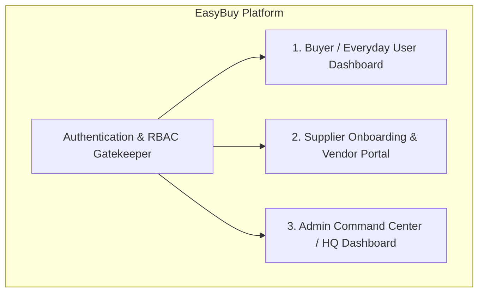
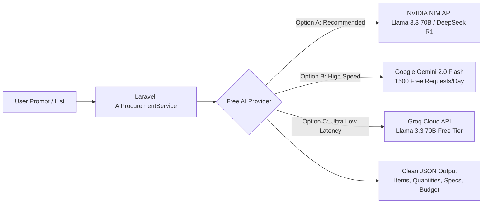
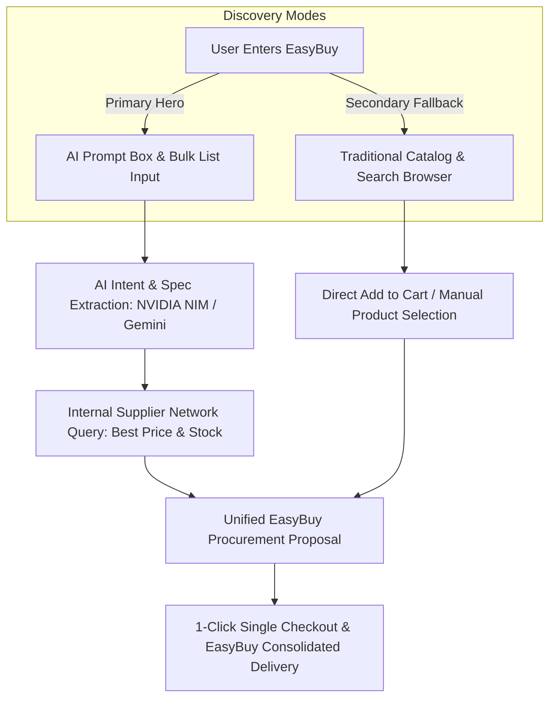
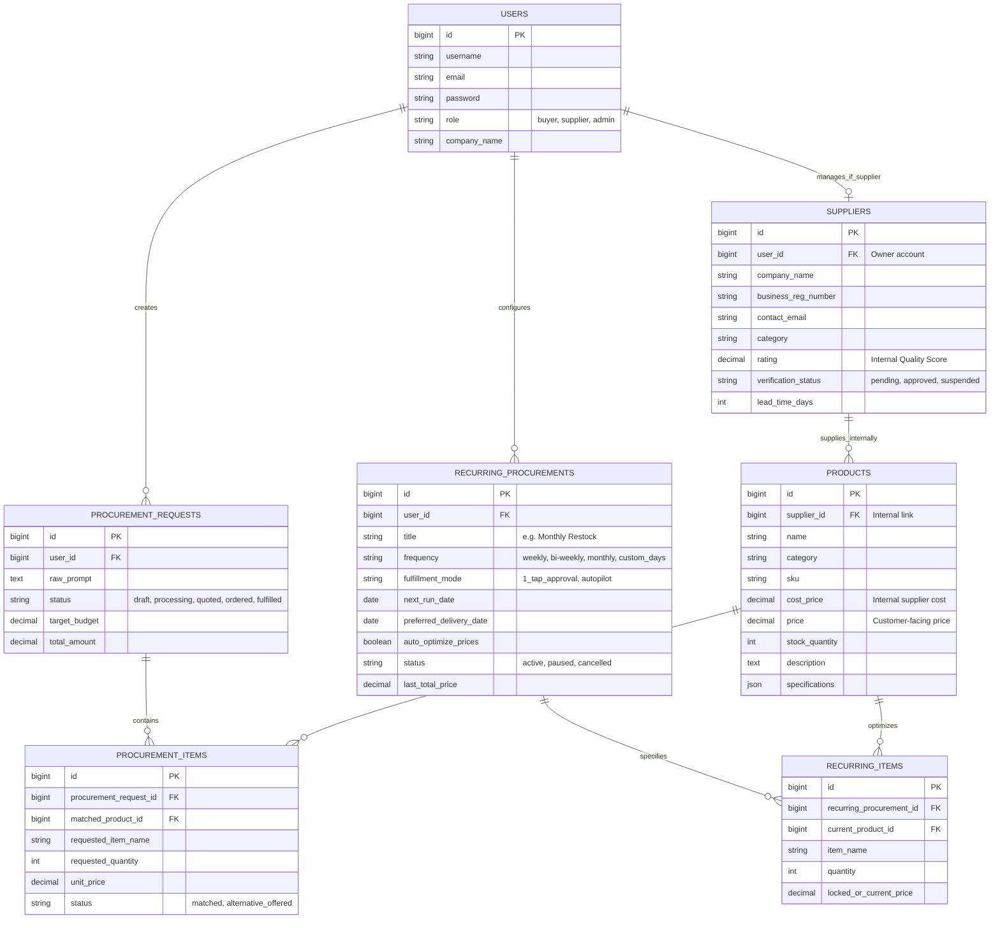

# EasyBuy: AI-Powered Smart Procurement Platform
## Product Vision, Multi-Portal Architecture & Technical Blueprint

---

## 1. Executive Summary & Core Principles

**EasyBuy** is an **AI-driven Unified Procurement & Autonomous Replenishment Engine** with a **Dual-Discovery (AI-First + Traditional Catalog)** interface.

### 🌟 Key Design Principles:

1. **AI-First Discovery with Traditional Catalog Fallback**:
   - **Primary Hero Interface**: When users visit EasyBuy, the **AI Procurement Prompt & List Box** is the centerpiece. It invites them to paste lists or describe needs directly.
   - **Traditional Catalog & Search (`/catalog` or `/shop`)**: For users who prefer visual browsing or single-item searching, an intuitive traditional catalog with category filters, search bar, and direct cart actions is accessible via a clear *"Or browse the catalog manually"* navigation.

2. **Single-Entity Trust (Unified Brand Experience)**:
   - **The Buyer Experience**: The buyer interacts exclusively with **EasyBuy**.
   - **EasyBuy as Merchant of Record**: EasyBuy handles quality verification, quotes, single-checkout invoicing, and consolidated customer support.
   - **Invisible Supplier Fulfillment**: Behind the scenes, the AI queries an **internal approved supplier network** to find stock and optimize prices. Customers receive a unified **"Sourced & Verified by EasyBuy"** delivery.

3. **Autonomous Recurring Replenishment & Dynamic Price-Watcher**:
   - Customers can set up recurring procurement requests (e.g., *"I need toilet paper and paper towels delivered on the 1st of every month"*).
   - **Continuous Price Optimization**: EasyBuy monitors supplier inventory and price fluctuations, continuously optimizing the customer's recurring basket with better deals and higher-quality alternatives.
   - **Two Fulfillment Modes**:
     - **1-Tap Approval Mode**: EasyBuy pre-packages the optimized order before the cycle date; customer taps "Confirm Delivery" to dispatch.
     - **Autopilot Mode**: Customer pre-authorizes payment and sets a delivery date; EasyBuy automatically optimizes, charges, and ships without manual intervention.

---

## 2. Multi-Portal & Dashboard Architecture

EasyBuy is built with **three distinct portals** tailored to each user type:

### 🧑‍💼 1. Buyer / Everyday User Dashboard (`/dashboard` or `/home`)
* **AI Procurement Prompt & List Workspace (Primary Hero)**: Natural language prompt input & raw list parser.
* **Traditional Catalog & Search Browser (`/catalog`)**: Grid of products, search filter, category tabs, and direct item checkout.
* **Instant Quotations & Proposals**: View itemized EasyBuy-certified proposals, custom bundle savings, and 1-click checkout.
* **Smart Replenishment & Recurring Hub**:
  - Manage active subscriptions (weekly, monthly, custom).
  - Toggle between **1-Tap Approval** and **Autopilot** modes.
  - Live "Money Saved by Price-Watcher" counter.
* **Consolidated Invoices & Tracking**: Download unified EasyBuy PDF invoices and track all order dispatches.

---

### 🏭 2. Supplier Portal & Onboarding (`/supplier`)
* **Self-Service Supplier Onboarding**: Application form for new suppliers to submit business details, categories, tax IDs, and lead times for EasyBuy approval.
* **Catalog & Wholesale Inventory Management**: Upload and manage internal SKU catalogs, wholesale cost prices, and live stock levels.
* **Dispatched Purchase Orders (POs)**: Receive internal fulfillment orders generated by EasyBuy with bulk packing slips.
* **Fulfillment & Dispatch Actions**: Mark orders as dispatched and attach shipping tracking codes.
* **Payout & Performance Analytics**: View earned revenue, pending payouts, and EasyBuy quality rating scores.

---

### 🛡️ 3. Admin Command Center (`/admin`)
* **Global Procurement Overview**: Monitor live AI parsing accuracy, order volume, and active replenishment pipelines.
* **Supplier Vetting & Approval Queue**: Review, approve, or reject new supplier onboarding applications.
* **Master Catalog & Margin Control**: Oversee all inventory, adjust wholesale-to-retail margin rules, and set category standards.
* **Price-Watcher & Replenishment Monitor**: Overview of scheduled recurring orders and automated cron executions.
* **User & Permissions Management**: Manage buyers, suppliers, and system admins.

---

## 3. Free & High-Performance AI Model Strategy

To power natural language parsing, entity extraction, and smart product matching **100% for free**, we can leverage top tier free API providers:

### Option A: NVIDIA NIM (Build.nvidia.com) — *Recommended*
* **Why it's great**: NVIDIA provides **1,000 free API credits** on registration and access to leading enterprise open-source models with an OpenAI-compatible API.
* **Top Models Available**:
  - `meta/llama-3.3-70b-instruct` (State-of-the-art for structured JSON and spec parsing).
  - `deepseek-ai/deepseek-r1` or `deepseek-ai/deepseek-v3` (Advanced reasoning & price matching).
* **Integration**: Uses standard OpenAI PHP SDK or Laravel `Http::withHeaders()` connecting to `https://integrate.api.nvidia.com/v1/chat/completions`.

### Option B: Google Gemini 2.0 Flash (Google AI Studio)
* **Why it's great**: Generous **free tier (15 Requests/Minute, 1,500 Requests/Day, 1M Tokens/Minute)**.
* **Native JSON Mode**: Guarantees valid JSON output matching our exact database schema schema.

### Option C: Groq Cloud API
* **Why it's great**: Free tier providing ultra-fast inference (<500ms) for `llama-3.3-70b-versatile`.

---

## 4. Core User Flows (Dual Discovery)

---

## 5. Database Schema Blueprint

---

## 6. Implementation Roadmap

### Phase 1: Multi-Role Foundation & Supplier Management
- [ ] Add `role` column (`buyer`, `supplier`, `admin`) to `users` table.
- [ ] Create `suppliers` table migration and `Supplier` Eloquent model.
- [ ] Create `SupplierOnboardingController` and Supplier dashboard views.
- [ ] Create Admin portal skeleton for managing supplier approvals.

### Phase 2: AI Parsing & Sourcing Service (NVIDIA NIM / Gemini)
- [ ] Build `AiProcurementService` in Laravel:
  - Connect to **NVIDIA NIM** (e.g. `meta/llama-3.3-70b-instruct`) or **Gemini Flash**.
  - Configure prompt engineering to parse unstructured lists into structured JSON.
- [ ] Implement the Database Matching & Price Optimizer:
  - Match parsed items against approved supplier products.
  - Calculate consolidated EasyBuy quotes.

### Phase 3: Smart Recurring Engine & Price Watcher
- [ ] Create `recurring_procurements` and `recurring_items` tables.
- [ ] Implement the Price Watcher background job / service:
  - Scans active recurring procurements against supplier inventory updates.
  - Automatically recommends/updates lower cost equivalent items.
- [ ] Implement the two fulfillment triggers:
  - **1-Tap Approval workflow**: Generates ready-to-order notification.
  - **Autopilot execution**: Automatic order creation on scheduled cycle date.

### Phase 4: Frontend Dashboards & Dual Discovery
- [ ] **Buyer Dashboard (`/home`)**:
  - **Hero**: Natural language AI procurement box & list processor.
  - Interactive proposal cards & 1-click checkout.
  - Recurring order management tab.
- [ ] **Traditional Catalog & Search Browser (`/catalog`)**:
  - Filter by category, keyword search, price slider.
  - Option to add individual items or convert browsed items into a procurement plan.
- [ ] **Supplier Dashboard (`/supplier/dashboard`)**:
  - Inventory & cost price editor.
  - Purchase order fulfillment tracker.
- [ ] **Admin Dashboard (`/admin/dashboard`)**:
  - Supplier vetting approvals.
  - Master catalog & margin controls.

---

## 7. Technology Stack
- **Framework**: Laravel 11 / 12 (PHP 8.3+)
- **Database**: MySQL (XAMPP)
- **Frontend**: Blade Components + Tailwind CSS + Vanilla JS
- **AI Integration**: NVIDIA NIM API (`meta/llama-3.3-70b-instruct`) / Google Gemini API
- **Scheduling & Background Tasks**: Laravel Task Scheduling & Queue Workers
- **Asset Pipeline**: Vite
